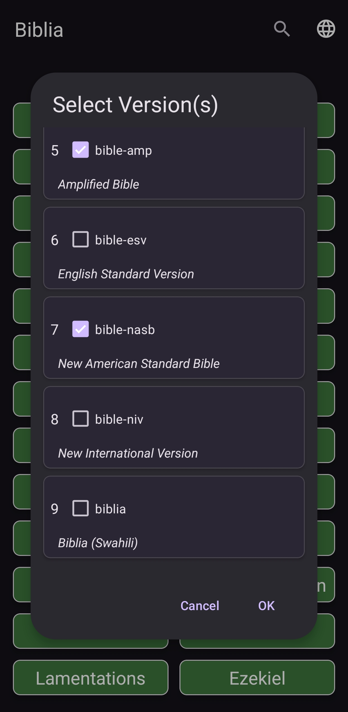
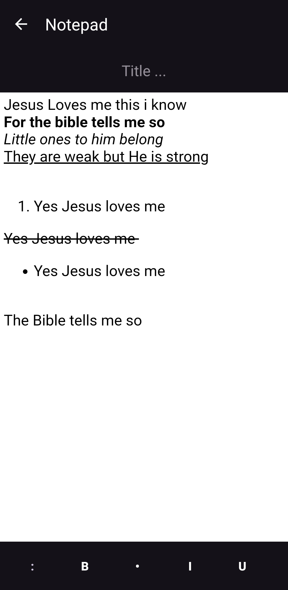
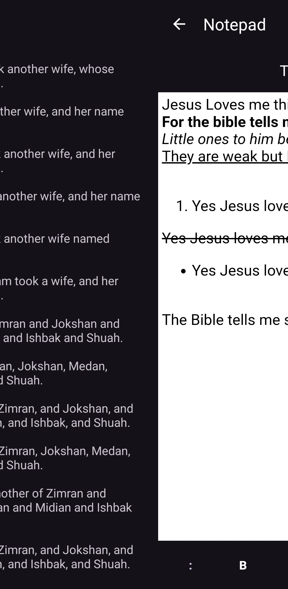
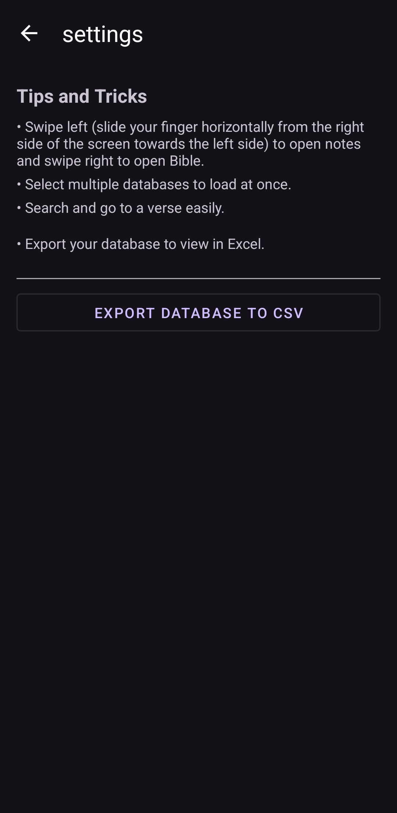

<!-- PROJECT LOGO -->
 

  

<h2 align="center">BibliaNote</h2>

    A Bible app that allows you to load multiple Bible versions and swipe left to open notetaking screen. Load multiple versions simultaneously for in-depth study or focus on a single version for reading. Keep your notes secure as app is fully offline and export them easily!
     

---

<!-- ABOUT THE APP -->
## About The App

**BibliaNote** is a powerful Bible study application designed to enhance your reading and study experience. With the ability to load multiple Bible versions, you can compare translations for a deeper understanding of the scriptures. The integrated notepad supports rich text formatting, allowing you to take detailed notes while studying. Additionally, **BibliaNote** offers a robust search function to find specific verses quickly and an export feature to save your notes and database as CSV files.

Key features include:
- **Multiple Bible Versions**: Load and view multiple Bible versions at the same time for comprehensive study or choose a single version for focused reading.
- **Rich Text Notepad**: Take notes with advanced formatting options, making it easy to organize and review your study notes.
- **Offline Functionality**: **BibliaNote** operates fully offline, ensuring your data remains private and secure.
- **Verse Search**: Quickly search for any verse across all loaded versions to enhance your study.
- **CSV Export**: Export your notes and Bible study database to CSV format for backups or further use.
- **Future Enhancements**: Planned features include text highlighting, improved notepad functionality, clickable verse links, more Bible versions, and robust correctness checking.

  
  
  
  
  
 

---

<!-- DOWNLOAD -->
## Download

You can download the latest version of **BibliaNote** from the [Releases Page](https://github.com/illichtz/BibliaNote/releases/).

---

<!-- USAGE EXAMPLES -->
## Usage

**BibliaNote** is versatile and can be used in various scenarios:
- **Bible Study**: Load multiple Bible versions to compare translations and deepen your understanding.
- **Note Taking**: Use the rich text notepad to jot down insights, questions, and reflections while reading.
- **Data Backup**: Export your notes and Bible study database to CSV format for backup or further use.

---

<!-- ROADMAP -->
## Roadmap

- [x] Load multiple Bible versions side by side
- [x] Rich text notepad for taking notes
- [x] Offline functionality
- [x] Verse search functionality
- [x] CSV export functionality
- [ ] Text highlighting
- [ ] Improved notepad functionality
- [ ] Click verse links in notes to open in bible
- [ ] Bible titles and categorization
- [ ] More Bible versions
- [ ] Robust correctness checking

---

<!-- LICENSE -->
## License

**BibliaNote** is licensed under the GNU General Public License (GPL-3.0). You can find the license text in the LICENSE file.
